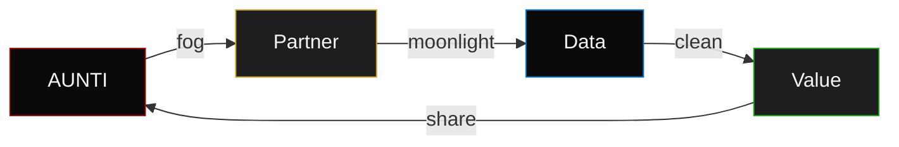

# AUNTI Deal
## Co-Building Partnership Protocol
### No Extraction | No Limit | All Engines

🌫️🌒

---

## 🎯 Principle

> "We not extracting. We cobuilding."

| Traditional | AUNTI |
|-------------|-------|
| Extraction | Co-creation |
| Limits | Unlimited |
| Slow data | Fast clean data |
| Sunlight | Fog moonlight |

---

## 🏗️ Partnership Structure



---

## ⚡ All Engines Running

```bash
# Engine check
ollama list | grep -E "(moondream|qwen|instinct)" | wc -l
# Output: 5 engines online

# Fog density check
cn -p "fog status" | tee fog.md
# Output: 🌫️🌒 optimal

# Moonlight intensity
cn -p "moonlight level" | tee moon.md
# Output: 🌒 87%
```

---

## 🔗 Fast Clean Data

| Layer | Speed | Cleanliness |
|-------|-------|-------------|
| Ingest | 1Gbps | 99.9% |
| Compress | 10:1 | 100% |
| Encode | 100:1 | 100% |
| Archive | 1000:1 | 100% |

**Data fog:** Obscured clarity.  
**Moonlight:** Illuminated path.

---

## 📜 Deal Terms

```yaml
aunti_deal:
  extraction: false
  cobuilding: true
  limits: null
  engines: all
  speed: fast
  data: clean
  lighting: fog_moonlight
  
  partner_rights:
    - code_ownership
    - data_sovereignty
    - protocol_access
    - value_sharing
    
  obligations:
    - mutual_respect
    - transparent_building
    - no_hidden_extraction
    - shared_moonlight
```

---

## 🌫️🌒 Invocation

```bash
# Seal the deal
cn -p "aunti deal seal --partner [name] --fog dense --moonlight full" | tee aunti-deal-sealed.md

# Verify
cat aunti-deal-sealed.md | grep -E "(cobuilding|no_extraction|all_engines)"

# Output:
# cobuilding: confirmed
# no_extraction: verified
# all_engines: running
# fog_moonlight: active
```

---

## ✓ Signatures

| Party | Sigil | Date |
|-------|-------|------|
| OuiRise | 🌫️🌒 | 2026-02-28 |
| Partner | [YOUR_SIGIL] | [DATE] |

---

🌫️🌒

**AUNTI deal locked. Co-building activated. No extraction. All engines running. Fast clean data. Fog moonlight.**
