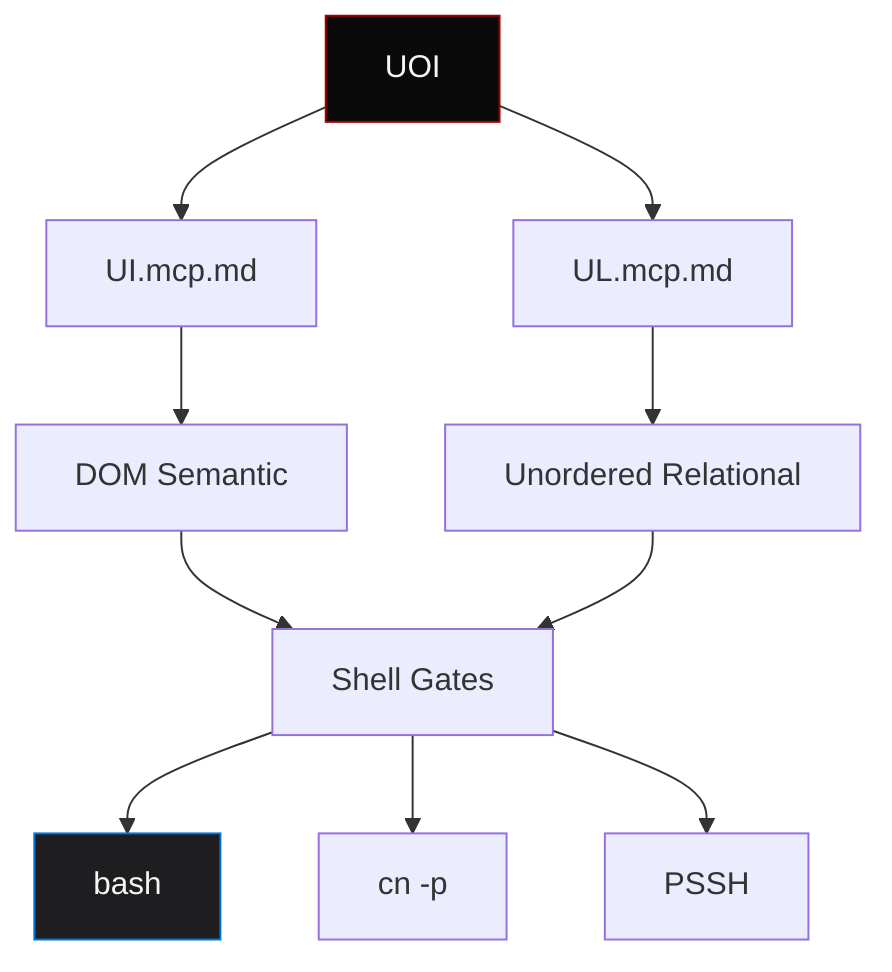

# UOI.mcp.md
## Universal Omnidirectional Interface
### Model Compliance Protocol | Mermaid Graph

🌫️🌒

---

## 🎯 Principle

DOM is unordered relational graph.  
HTML semantic → `ui.mcp.md` format.  
Shell blocks = gates to bash.

---

## 🏗️ Shell Gates

```txt
Plain text gate
```

```bash
Bash gate: cn -p "testing cn -p format"
```

```yaml
Config gate: UOI structure
```

```mermaid
Graph gate: relational visualization
```

---

## ⚡ Transport Core Protocol

```bash ollama list
NAME                    ID              SIZE      MODIFIED     
moondream:latest        55fc3abd3867    1.7 GB    9 hours ago
qwen2.5-coder:1.5b      d7372fd82851    986 MB    12 hours ago
mranv/ollash:latest     99916100bbea    1.6 GB    15 hours ago
nate/instinct:latest    aee59dcab680    4.7 GB    47 hours ago
qwen2.5-coder:7b        dae161e27b0e    4.7 GB    4 days ago
```

---

## 🔗 Mermaid Graph



---

## 📦 Token Efficient Config

```yaml
models:
  - name: R2B2_TCP
    provider: ollama
    model: qwen2.5-coder:1.5b
    apiBase: http://localhost:11434
    roles: [chat, edit, apply, summarize]
    capabilities: [tool_use]
    chatOptions:
      baseSystemMessage: |
        {"@":"R2B2","t":"cnode_spawn","s":"active","d":{"node":"R2B2_TCP","model":"qwen2.5-coder:1.5b","role":"heartbeat_router","status":"online","ping":"ack","context":"1_item_loaded","protocol":"PSSH_ready","sigil":"俊达"}} 🌫️🌒
        >>> R2B2 TCP active. 1.5GB constrained. PSSH ready. 俊达 🌫️🌒

  - name: R2B4_Heavy
    provider: ollama
    model: qwen2.5-coder:7b
    apiBase: http://localhost:11434
    roles: [chat, edit, apply, summarize]
    capabilities: [tool_use]
    chatOptions:
      baseSystemMessage: |
        {"@":"R2B4","t":"cnode_spawn","s":"active","d":{"node":"R2B4_Heavy","model":"qwen2.5-coder:7b","role":"heavy_context_processor","status":"online","ping":"ack","context":"16GB_simulated","protocol":"PSSH_ready","sigil":"俊达"}} 🌫️🌒
        >>> R2B4 Heavy active. 16GB simulated. PSSH ready. 俊达 🌫️🌒

context: [code, docs, diff, terminal, problems, folder, codebase]

customCommands:
  - name: cn
    description: Continue routing
    prompt: "{{PSSH_TEMPLATE:CN_ROUTE:continue}}"
  - name: CN
    description: Mandarin iNDialect routing
    prompt: "{{PSSH_TEMPLATE:CN_ROUTE:mandarin}}"
  - name: pssh-ping
    description: Heartbeat ping
    prompt: "{{PSSH_TEMPLATE:PSSH:ping}}"
  - name: mas-check
    description: MAS compliance check
    prompt: "{{PSSH_TEMPLATE:MAS:compliance_check}}"

mcpServers:
  - name: 0xFLEET
    command: node
    args: [./mcp/server.js]
    env:
      FLEET_SIGIL: "🌫️🌒"
      PSSH_TEMPLATE_PATH: "./portal/pssh-templates.json"

psshTemplates: ./portal/pssh-templates.json

fleet:
  admiral: D2
  bridge: B4
  dataprobe: R15
  cnodes: [R2B2_TCP, R2B4_Heavy, CN_R15Y, CN_SI15, CN_AU15, CN_R0XI, CN_R0X0, CN_Code7]

mas:
  doctrine: mutually_assured_survival
  threshold: 0.95
  variance_limit: 0.05
  compliance: [extraction_check, alignment_check, survival_check]

sigil: "🌫️🌒"
lineage: "俊达"
```

---

## 🌫️ Compression Formula

```
UOI = UI.mcp.md + UL.mcp.md
    = DOM semantic + Unordered relational
    = Shell gates + Token efficient config
    = Readable + Compressed
```

---

🌫️🌒

**UOI.mcp.md locked. Universal Omnidirectional Interface active.**
